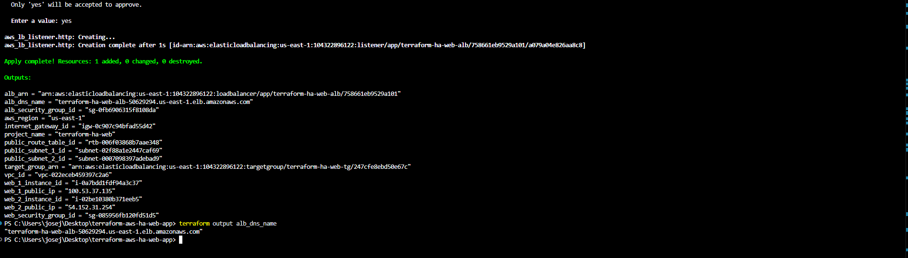
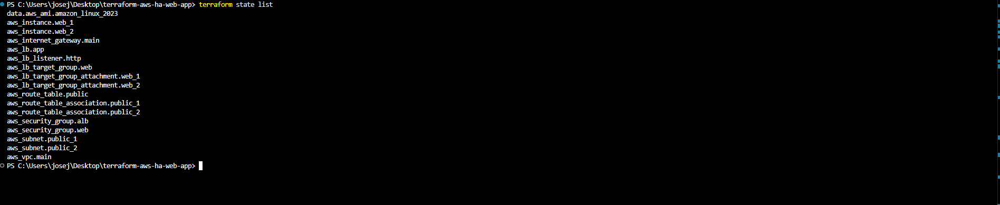
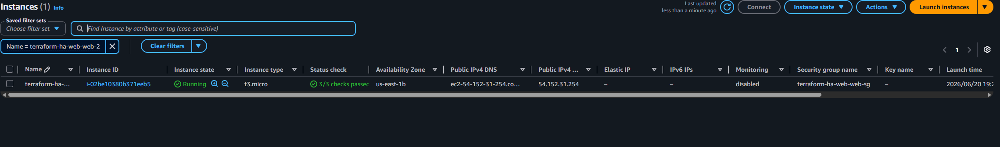
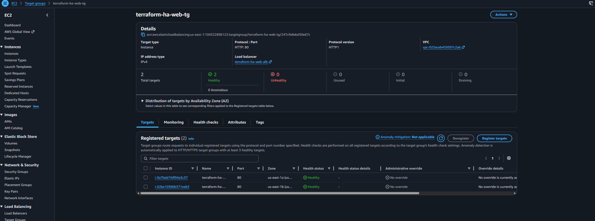
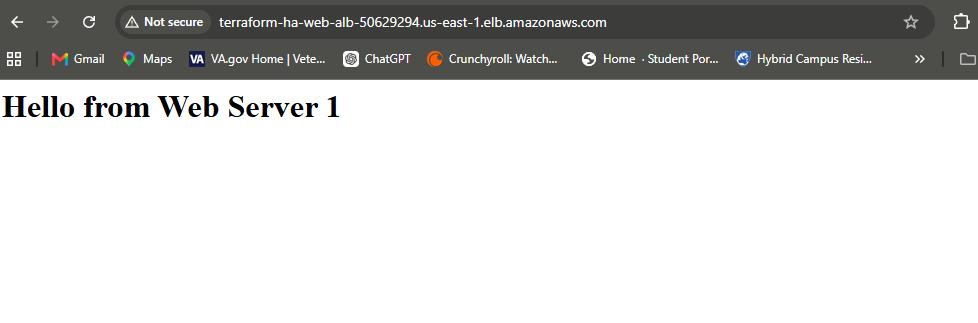
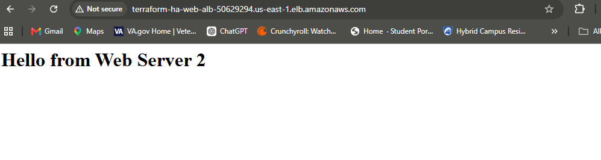

# Terraform AWS Highly Available Web App

## Project Overview

This project uses Terraform to deploy a highly available web application infrastructure on AWS. The environment includes a custom VPC, two public subnets across different Availability Zones, an Internet Gateway, public routing, security groups, two EC2 web servers, an Application Load Balancer, a target group, and an HTTP listener.

The goal of this project is to demonstrate Infrastructure as Code, AWS networking, load balancing, and basic cloud automation.

## Architecture

Internet traffic flows through the Application Load Balancer and is forwarded to two EC2 web servers running Apache.

```text
Internet
   ↓
Application Load Balancer
   ↓
Target Group
   ↓
EC2 Web Server 1 / EC2 Web Server 2

AWS Resources Created
Custom VPC
Two public subnets
Internet Gateway
Public route table
Route table associations
ALB security group
Web server security group
Two EC2 instances
Application Load Balancer
Target group
Target group attachments
HTTP listener
Tools Used
Terraform
AWS
AWS CLI
Visual Studio Code
GitHub

Terraform Commands Used
terraform init
terraform fmt
terraform validate
terraform plan
terraform apply
terraform output
terraform state list

Validation

The project was tested by accessing the Application Load Balancer DNS name in a browser. The load balancer successfully routed traffic between Web Server 1 and Web Server 2.

Screenshots

## Screenshots

### Terraform Apply Complete


### Terraform Outputs


### EC2 Instances Running


### Target Group Healthy


### Browser Test - Web Server 1


### Browser Test - Web Server 2


Screenshots include:

Terraform apply completed
Terraform outputs
AWS EC2 instances running
Target group health checks
Browser test showing Web Server 1
Browser test showing Web Server 2
Skills Demonstrated
Infrastructure as Code
AWS VPC networking
Public subnet configuration
Route table and Internet Gateway setup
EC2 provisioning
Apache web server automation using user data
Security group configuration
Application Load Balancer setup
Terraform state management
Cloud infrastructure documentation